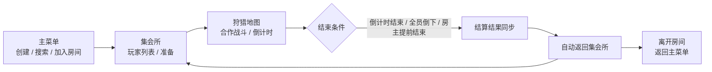
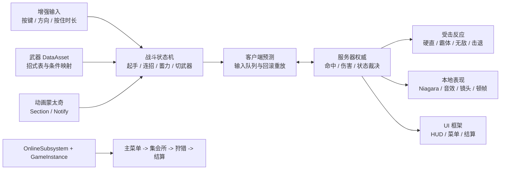

<div align="center">

# MH

**基于 Unreal Engine 5.8 与 C++ 的四人局域网合作狩猎动作原型**

[](https://www.unrealengine.com/)
[](https://isocpp.org/)
[](#4-完整的局域网联机流程)
[](#仓库范围)
[](#当前范围与限制)

</div>

## 项目简介

MH 是一个以“动作战斗手感、联机一致性和策划配置效率”为核心的四人在线合作狩猎原型。项目目前完成了从创建或加入局域网房间、集会所准备、进入狩猎、倒计时与结算，到返回集会所和主菜单的可运行闭环。

> [!IMPORTANT]
> GitHub 仓库当前仅发布 C++ 源码与文档，不包含 `MH.uproject`、`Config/` 和 `Content/`。因此运行 `git clone` 后不能直接打开或运行完整游戏；可运行版本来自包含全部工程资产的本地完整工程。

它的重点不是堆叠完整游戏内容，而是验证一套可继续扩展的 UE5 游戏客户端基础能力：

- 数据驱动的武器、招式、连段和打击反馈配置。
- 服务端权威、客户端预测回滚的联机动作战斗。
- 命中、伤害、受击反应、镜头与特效反馈的完整链路。
- 可复用的分层 UI 框架和联机游戏流程。
- 可重复执行的双进程端到端流程自检。

## 简历速览

- 基于 Unreal Engine 5.8 与 C++ 开发四人局域网合作狩猎动作原型，完成主菜单、集会所、狩猎、结算与返回流程的联机闭环。
- 设计基于 DataAsset 的武器与连段配置方案，策划可在编辑器中配置地面或空中起手、方向输入、长按、优先级、蓄力、连段和打击反馈，新增武器与招式无需改动战斗状态机。
- 实现 Listen Server 权威的动作战斗网络模型，包含客户端输入预测、服务器确认、未确认输入回滚重放和动画进度校正，在保证本地即时响应的同时统一命中、伤害与死亡结果。
- 实现武器扫掠命中、伤害与受击反应、顿帧、镜头震动、Niagara 和随机音效等战斗反馈，并搭建覆盖建房、加入、准备、开局、结算和返回主菜单的双进程自动流程测试。

## 核心亮点

### 1. 策划友好的武器与连段配置

每个武器由独立的 `UWeaponDataAsset` 描述，战斗组件只负责解释配置和运行状态机，不把某一套连招硬编码在逻辑里。

策划可以在编辑器中配置：

| 配置项 | 可表达的业务规则 |
| --- | --- |
| 地面起手 | 不同按键、方向或长按条件触发的第一招 |
| 空中起手 | 角色离地时使用的独立招式入口 |
| 连段关系 | 当前招式的下一招、分支条件和选择优先级 |
| 输入条件 | 按键、按下或松开、移动方向、最短按住时长 |
| 蓄力动作 | 按下NotifyState阶段慢放蓄力、松手后蒙太奇正常播放 |
| 动作时机 | 攻击开始、命中窗口、连招窗口、允许切武器和动作结束 |
| 打击反馈 | 每个招式独立的伤害、击退、硬直、韧性和表现资源 |

时间点由动画蒙太奇上的 Notify 与 NotifyState 驱动，而不是散落在代码里的固定秒数。由此可以组合出“方向键接轻攻击”“长按重攻击”“空中攻击接落地追击”等连段，并让策划在动画和数值资产中快速迭代。

一句话概括业务价值：新增武器或调整连段时，主要工作集中在 DataAsset 与动画通知配置，战斗状态机保持稳定，可显著降低策划试错和程序联调成本。

### 2. 服务端权威的联机动作战斗

战斗采用 Listen Server 权威模型：

- 本机玩家按下攻击后立即执行一次预测，保证操作没有等待服务器的延迟感。
- 每条输入带有序号并发送到服务器，服务器按序执行并返回已确认序号与权威状态快照。
- 客户端收到快照后恢复权威逻辑状态，再重放尚未确认的输入，必要时重新对齐当前蒙太奇、Section 和播放进度。
- 命中、伤害、无敌、霸体、死亡和击退只由服务器裁决，客户端只消费确认结果和播放表现。
- 支持攻击输入缓冲、蓄力释放、连段窗口、受击打断和限定时间内的武器切换。

该方案保证丢包、乱序和分支判断不一致时仍能收敛，同时保留本地输入的先手反馈。它属于动作状态预测与回滚，不包含完整的角色移动或物理模拟回滚。

### 3. 完整的命中与打击反馈链路

一次攻击从输入到表现包含以下环节：

1. 服务器在命中窗口内对武器骨骼位置进行连续扫掠检测。
2. 同一招式对同一目标只结算一次，避免一次挥砍重复扣血。
3. 根据招式配置计算伤害、击退、硬直、削韧和是否打断目标。
4. 目标处理无敌、霸体、方向性受击反应和硬直期间的状态恢复。
5. 服务器把确认后的稀疏命中事件复制给所有客户端。
6. 各客户端在命中点本地生成 Niagara 与随机音效，攻击者本机额外获得镜头震动和顿帧，UI 也可直接消费命中事件。

这种拆分让权威战斗结果与纯表现反馈保持解耦，既便于联机同步，也方便后续继续增加飘字、连击计数、手柄震动或平台适配。

### 4. 完整的局域网联机流程

当前使用 `OnlineSubsystemNull + LAN + Listen Server`，最大四人，已经打通以下流程：



流程层包含：

- 房间名称、人数、Ping 和服务器的创建、搜索、加入与销毁。
- 房主权限校验、全员准备和房主开始狩猎。
- Seamless Travel 在三个关卡和原生 GameMode 之间切换。
- 比赛状态、剩余时间和结算文本的服务器复制。
- 房主提前结束、时间结束、全员倒下和自动返回集会所。
- 房主离开时通知其他玩家一起返回主菜单。

### 5. 可复用的分层 UI 框架

UI 采用每个本地玩家独立的 `UUIManager` 管理，页面分为常驻 HUD、Screen、Popup 和 Overlay，并维护独立页面栈和显示优先级。

框架提供：

- 页面打开、覆盖、恢复、关闭和返回键路由。
- 输入模式、鼠标显示、键盘焦点和页面 ZOrder 管理。
- 基于 ViewModel 和可订阅属性的 MVVM 数据绑定。
- 页面数据源变化后的自动重解析，适配 PlayerController、Pawn 重生和切图。
- GameInstance 级事件总线，用于页面之间的解耦通信。
- 通过 Client RPC 在联机客户端打开 HUD 或全屏页面。
- 切图、重连和控制器替换时的旧 UI 清理。

主菜单、集会所、狩猎 HUD、狩猎菜单和流程页面都通过这套框架接入，避免每个页面自行处理输入和生命周期。

### 6. 自动化联机流程验证

项目提供仅开发期编译的双进程流程自检。房主进程和客户端进程分别启动后，可以自动完成：

```text
主菜单 -> 创建或搜索房间 -> 加入集会所 -> 双方准备 -> 开始狩猎
-> 倒计时与结算复制 -> 自动返回集会所 -> 离开房间 -> 返回主菜单
```

成功时会输出 `RESULT=HOST_PASS` 和 `RESULT=CLIENT_PASS`。Shipping 构建不会编译这套自检逻辑，不影响正式包体。

## 核心架构



## 仓库范围

远端 `main` 分支当前只跟踪以下内容：

| 内容 | 是否位于 GitHub | 说明 |
| --- | --- | --- |
| `Source/` | 是 | 全部 UE C++ 模块与业务代码 |
| `Docs/` | 是 | 战斗、UI 与联机流程文档 |
| `README.md` | 是 | 项目说明与简历项目描述 |
| `MH.uproject` | 否 | 完整工程入口，仅存在于本地完整工程 |
| `Config/` | 否 | 输入、地图和 OnlineSubsystem 配置 |
| `Content/` | 否 | 包含关卡、蓝图、动画、音频和第三方资源 |

因此：`git clone` 适合查看和评估 C++ 源码，不能直接打开或运行完整游戏。`Content/` 体积较大，且包含多个第三方资源包，不适合未经筛选地放入 GitHub 仓库。

## 获取与运行

### 克隆源码

```powershell
git clone https://github.com/HalQu/MH.git
```

克隆完成后可以阅读 C++ 模块、页面框架、战斗网络模型和设计文档，但仓库中不存在 `MH.uproject`、地图与游戏资产。

### 运行完整项目

需要使用包含以下内容的完整工程目录：

- `MH.uproject`
- `Config/`
- `Content/`，包括 `BeginMap`、`LobbyMap`、`HuntingMap`、输入资产、动画与音效资源
- 与本仓库一致的 `Source/`

环境要求：

- Unreal Engine `5.8`
- Windows
- Visual Studio 2022 或 Rider，并安装 Unreal Engine C++ 工作负载
- 客户端之间可以使用局域网连接

运行步骤：

1. 在完整工程目录中右键 `MH.uproject`，生成 Visual Studio 工程文件。
2. 使用 UE 5.8 打开项目并完成 C++ 编译。
3. 从 `BeginMap` 启动，或直接使用编辑器中的 Play 功能。
4. 联机调试时，建议使用 Listen Server 多窗口或两个独立客户端进程。

具体键位统一配置在 `Content/Input/IMC_Main` 与相关 Enhanced Input 资产中。

## 目录结构

```text
MH/
├─ Source/MH/                    [GitHub] C++ 源码
│  ├─ GamePlay/Combat/           战斗、命中、生命与受击组件
│  ├─ GamePlay/GameMode/         主菜单、集会所与狩猎 GameMode
│  ├─ UI/Core/                   UIManager、页面基类、ViewModel、事件总线
│  └─ UI/Screen/                 主菜单、集会所、HUD 与狩猎菜单
├─ Docs/                         [GitHub] 系统设计与接入文档
│  ├─ CombatConfiguration.md     当前战斗与连段配置手册
│  ├─ UISystemUsage.md           当前 UI 框架接入手册
│  └─ GameFlow.md                当前联机流程与自检说明
├─ Config/                       [本地完整工程] 引擎、输入与联机配置
├─ Content/                      [本地完整工程] 关卡、蓝图、动画、音频与材质
└─ MH.uproject                   [本地完整工程] 项目入口
```

## 详细文档

- [战斗配置手册](Docs/CombatConfiguration.md)：武器 DataAsset、连段条件、蒙太奇 Section 与 Notify 配置。
- [UI 系统使用手册](Docs/UISystemUsage.md)：页面层级、ViewModel、输入焦点、事件总线与联机 UI。
- [联机游戏流程](Docs/GameFlow.md)：会话生命周期、RPC、场景切换与双进程流程自检。

> `Docs/CombatSystem.md` 和 `Docs/CombatNetworkingStage1.md` 反映较早阶段。当前实现请优先参考源码、`CombatConfiguration.md`、`UISystemUsage.md` 与 `GameFlow.md`。

## 当前范围与限制

本地完整工程是“可运行、可继续扩展的动作原型”，GitHub 远端则是“源码与文档展示仓库”。二者都不是完整商业游戏：

- 尚未实现怪物 AI、任务目标、装备成长和奖励结算。
- 存档与读档目前只有预留接口，没有完整数据落盘流程。
- 联机仅覆盖 LAN 与 Listen Server，尚未接入 Steam、EOS 或独立 Dedicated Server。
- 当前没有断线重连、房间密码、观战和完整匹配系统。
- 战斗预测覆盖动作状态与输入回放，不包含完整的角色移动和物理回滚。
- 关卡、怪物、技能和生产工具链仍处于原型阶段。

## 第三方资源说明

项目中的部分动画、音效和 Niagara 资源来自第三方学习资源或示例资源包，包括：

- EssentialGreatSwordAnimationPack
- Free Realistic Sword Sound Effects Pack
- SlashTrail_SoftTofu

这些资源的版权归各自作者或发行方所有，仓库中的使用仅用于学习、开发验证与作品展示。本仓库当前未附带统一的开源许可证，使用代码或资源前请先确认相应授权范围。
